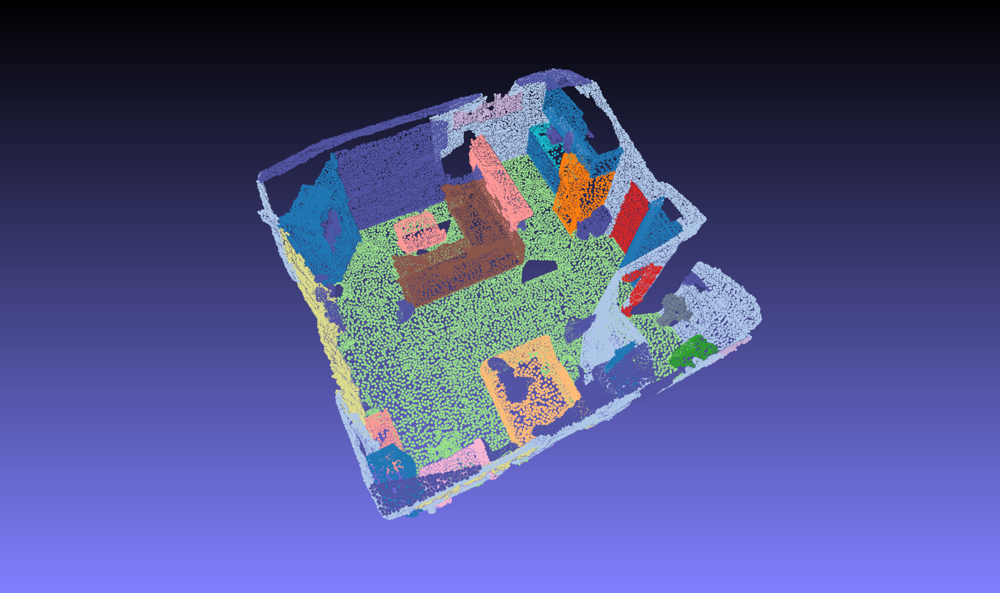
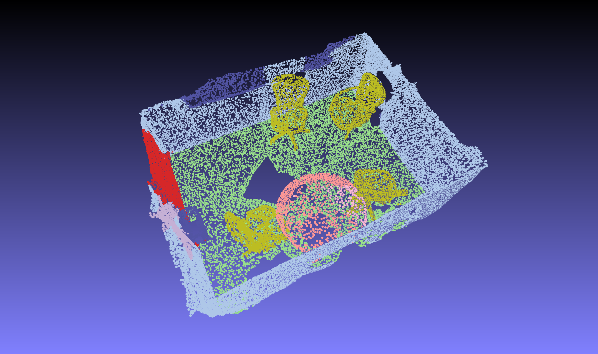

# Pointnet2.ScanNet
PointNet++ Semantic Segmentation on ScanNet in PyTorch with CUDA acceleration based on the original [PointNet++ repo](https://github.com/charlesq34/pointnet2) and [the PyTorch implementation with CUDA](https://github.com/sshaoshuai/Pointnet2.PyTorch)

## Performance
The semantic segmentation results in percentage on the ScanNet train/val split in `data/`.

| use XYZ | use color | use normal | use multiview | use MSG | mIoU | weights |
|---------|-----------|------------|---------------|---------|------|---------|
|:heavy_check_mark:         |:heavy_check_mark:           |:heavy_check_mark:            |:white_check_mark:               |:white_check_mark:         |50.48      |[download](https://drive.google.com/file/d/16rsLQwonnf0vvAi4QFaUg6xCxD2pJqEP/view?usp=sharing)         |
|:heavy_check_mark:         |:heavy_check_mark:           |:heavy_check_mark:            |:white_check_mark:               |:heavy_check_mark:         |52.50      |[download](https://drive.google.com/file/d/1iMmuZgh8VeYO02tdOSgSKVyXDcvXPior/view?usp=sharing)         |

If you want to play around with the pre-trained model, please download the zip file and unzip it under `outputs/`.


## Installation
### Requirements
* Linux (tested on Ubuntu 14.04/16.04)
* Python 3.6+
* PyTorch 1.8
* TensorBoardX

Please run `conda install pytorch==1.8.0 torchvision==0.9.0 torchaudio==0.8.0 cudatoolkit=10.2 -c pytorch` to install PyTorch 1.8 and run `pip install -r requirements.txt` to install other required packages.

### Install CUDA accelerated PointNet++ library
Install this library by running the following command:

```shell
cd pointnet2
python setup.py install
```

### Configure
Change the path configurations for the ScanNet data in `lib/config.py`

### Prepare multiview features (optional)
1. Download the ScanNet frames [here](http://kaldir.vc.in.tum.de/3dsis/scannet_train_images.zip) (~13GB) and unzip it under the project directory.

2. Extract the multiview features from ENet:
```shell
python scripts/compute_multiview_features.py
```

3. Generate the projection mapping between image and point cloud
```shell
python scripts/compute_multiview_projection.py
```

4. Project the multiview features from image space to point cloud
```shell
python scripts/project_multiview_features.py
```

## Usage
### Preprocess ScanNet scenes
Parse the ScanNet data into `*.npy` files and save them in `preprocessing/scannet_scenes/`
```shell
python preprocessing/collect_scannet_scenes.py
```
### Panity check
Don't forget to visualize the preprocessed scenes to check the consistency
```shell
python preprocessing/visualize_prep_scene.py --scene_id <scene_id>
```
The visualized `<scene_id>.ply` is stored in `preprocessing/label_point_clouds/` - Drag that file into MeshLab and you'll see something like this:



### train
Train the PointNet++ semantic segmentation model on ScanNet scenes with raw RGB values and point normals (for more training options, see `python scripts/train.py -h`)
```shell
python scripts/train.py --use_color --use_normal --use_msg
```
The trained models and logs will be saved in `outputs/<time_stamp>/`

### eval
Evaluate the trained models and report the segmentation performance in point accuracy, voxel accuracy and calibrated voxel accuracy
```shell
python scripts/eval.py --folder <time_stamp>
```

> Note that all model options must match the ones used for training.

### vis
Visualize the semantic segmentation results on points in a given scene
```shell
python scripts/visualize.py --folder <time_stamp> --scene_id <scene_id>
```

> Note that all model options must match the ones used for training.

The generated `<scene_id>.ply` is stored in `outputs/<time_stamp>/preds` - Drag that file into MeshLab and you'll see something like the one below. See the class palette [here](http://kaldir.vc.in.tum.de/scannet_benchmark/img/legend.jpg)



## Changelog

* __07/29/2021__ Upgrade to PyTorch 1.8 & fix existing issues
* __03/29/2020__ Release the code

## TODOs

- [] Release all pretrained models

## Acknowledgement
* [charlesq34/pointnet2](https://github.com/charlesq34/pointnet2): Paper author and official code repo.
* [sshaoshuai/Pointnet2.PyTorch](https://github.com/sshaoshuai/Pointnet2.PyTorch): Initial work of PyTorch implementation of PointNet++ with CUDA acceleration.
